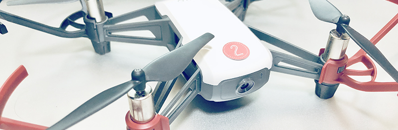
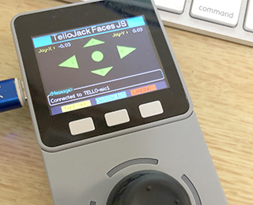

# TelloJack
for Tello toy drone controller program.

## TelloJackについて
[TELLOは、RYYZE社](https://www.ryzerobotics.com/jp/tello)の200g以下の軽量トーイドローンです。このドローンは、操作コマンドが公開されているため、多くの方が、操作させるプログラムを作って公開されています。

TelloJackは、MicJackにTelloのコントロールの機能を組み込んだ時に、それをTelloJackと呼んでいました。今回、M5StackやOdroid-GOで動かせるようにしたものを作りましたので、同じ名称で公開しました。MicJackでESP-WROOM-02で動くようなものを作っていたんですが、インターフェースは @hsgucciさん([GitHub](https://github.com/hsgucci404/m5stack_tello), [Quitta](https://qiita.com/hsgucci/items/4571c060ece376f80db3) )のプログラムをモディファイさせて頂いております。ご利用は各自の責任において利用して下さい。これを使ったことによるいかなるトラブルに関して、私は一切の責任を負いません。

<table border="0">
<tr>
<td></td>
<td></td>
</tr>
<tr>
<td></td>
<td></td>
</tr>
<tr>
<td></td>
<td></td>
</tr>
</table>

#### 同梱内容
- TelloJack.ino (Arduinoのメインスケッチ：中、全然整理できてなくて見難いです)
- JoyC.cpp / JoyC.h (JoyC用のコード）
- binフォルダ
	- TelloJack\_Accel.bin (**左上写真**：Gray, fireの加速度センサーで傾けて操作します）
	- TelloJack\_JS\_M5Stack.bin（**右上写真**：[JoyStickユニット](https://docs.m5stack.com/#/en/unit/joystick)をつなげて操作します）
	- TelloJack\_FacesJS.bin（**左中央写真**：[Faces](https://docs.m5stack.com/#/en/core/face_kit)の[JoyStickモジュール](https://docs.m5stack.com/#/en/module/joystick)で操作します）
	- TelloJack\_GO.bin（**右中央写真**：[Odroid-GO](https://www.hardkernel.com/shop/odroid-go/) arduino版）
	- TelloJack\_GO.fw（[Odroid-GO](https://www.hardkernel.com/shop/odroid-go/) 純正ファームウエア版）
	-  TelloJack\_JS\_M5StickC.bin（**左下写真**：[JoyStickユニット](https://docs.m5stack.com/#/en/unit/joystick)をつなげて操作します。現在、HAT JoyStickには対応していません）
	-  TelloJack\_JoyC.bin（**右下写真**) [JoyC](https://www.switch-science.com/catalog/6207/)をつなげて操作します）
	-  **TelloJack.json**：[M5Burner_Mic](https://github.com/micutil/M5Burner_Mic)用のプリセットファイルです。[M5Burner_Mic](https://github.com/micutil/M5Burner_Mic)を起動後、このファイルを[M5Burner_Mic](https://github.com/micutil/M5Burner_Mic)のウインドウにドラッグ＆ドロップすると、上記バイナリーを簡単にインストールできます。注意）M5StickCにインストールする場合は、転送速度を750000bpsを選択して下さい。

- SD-Updaterフォルダ：上記の中でM5Stack用のプログラムはSD-Updaterに対応させてあります。SD-Updaterフォルダには[SD-Updater](https://github.com/tobozo/M5Stack-SD-Updater)用のjpgやjsonファイルが入っています。SD-Updater対応の[LovyanLauncher](https://github.com/lovyan03/M5Stack_LovyanLauncher) がオススメです。
- imageフォルダ（README.md用の画像が入ってます）

##### その他
1. TelloJack.inoは[ESP32-Chimera-Core by tobozo](ttps://github.com/tobozo/ESP32-Chimera-Core)を使っています。
2. FACESは、最近ボトム単体でも売られています。[FACES BOTTOM](https://docs.m5stack.com/#/en/module/faces)、[FACES II BOTTOM](https://docs.m5stack.com/#/en/module/facesII) と２種類あります。
3. Odroid-GO 純正ファームウエア版は、[FWConverter](https://github.com/micutil/Odroid-GO_FWConverter)を使って作成しています。

## 操作方法
#### ＜Telloに接続（M5Stack版、Odroid-GO版の場合）＞

1. Telloのスイッチを入れる。
2. TelloJackを起動するとWi-Fiをスキャンされます。**左側の"NEXT"ボタン**を押すと取得したSSIDを順に表示します。
2. TelloのSSIDが見つからない場合は、**右側の"SCAN"ボタン**を押して下さい。
3. 接続するTelloが見つかったら、**中央の"CONNECT"ボタン**を押して下さい。うまく接続できると、**"Connect to [TelloのSSID名]"**と表示されます。

**重要）** もしTelloの接続にパスワードを設定している場合は、ファイル名がSSID名のテキストファイルを作成し、そのファイルの中にパスワードを記述し、そのファイルをmicroSDをM5Stack/Odroid-GOに入れておけばそのファイルに書かれているパスワードを参照して接続します。** 

[**＜クリックすると接続の動画が見られます＞**](https://www.youtube-nocookie.com/embed/q9aXnZNxYyE) 

#### ＜飛行操作（M5Stack、Odroid-GOの場合）＞

1. "TAKE OFF"ボタンで離陸します。
2. "LAND"ボタンで着陸します。
3. **Accelerometor版（加速度センサー版）**はM5Stackを前後左右に傾けると前進後退左右に動きます。また、**中央の"CW/CCW/UP/DOWN”ボタン**を押していると、上昇下降左回転右回転の動作になります。
3. **JoyStick版**は、ジョイスティックを上下左右で前進後退左右に動きます。Accel版と同様に**中央の"CW/CCW/UP/DOWN”ボタン**を押していると、上昇下降左回転右回転の動作になります。また、JoyStick版は、ジョイスティックを押して動かしても上昇下降左回転右回転の動作になります。

## 　

#### ［Telloに接続（M5StickC版の場合）］

M5StickCのボタン名について

		Aボタン：”M5"と書かれてるボタン
		Bボタン：Aボタンの右側面のボタン
		Cボタン：Aボタンの左側面のボタン
		JSボタン：JoyStickのボタン

1. Telloのスイッチを入れる。
2. TelloJackを起動するとWi-Fiをスキャンされます。**BボタンまたはJSボタン**を押すと取得したSSIDを順に表示します（JoyCの場合は、左右のJSボタンでSSIDの表示を進めたり戻したりできます）。
3.  TelloのSSIDが見つからない場合は、**Cボタン**を押すと、再スキャンします。
4.  接続するTelloが見つかったら、**Aボタン**を押します。**パスワード**が表示されます。
5.  パスワードに間違いがなければ、もう一度**Aボタン**を押すと接続を開始します。うまく接続ができれば、**"Connect to [TelloのSSID名]"**と表示されます。

**パスワードの設定方法**

現在、パスワード編集用の特別なインターフェイスを作ってないので、以下の手順でコンピュータからパスワードを送信して下さい。

1. パスワードが表示されている画面の時に、**Cボタン**を押すと、パスワードを編集モードになります。
2. コンピュータからArduinoのシリアルモニタや各種ターミナルソフトなどでパスワードを入力して下さい。
3. もう一度**Cボタン**を押すと、編集モードが終了になります。

#### ［飛行操作（M5StickCの場合）］

- **AボタンまたはJSボタン**で離陸します。
- **CボタンまたはJSボタン**で着陸します。
- **JoyStick unitの場合：** スティックを前後左右に動かすと前進後退左右に、Aボタンを押しながらスティックを前後左右に動かすと上昇下降左回転右回転の動きになります。
- **JoyCの場合：** 右側スティックを前後左右に動かすと前進後退左右に、左側スティックを前後左右に動かすと上昇下降左回転右回転の動きになります。
- **HAT JoyStickの場合：** 現在未対応です。スティックを動かしても思ったように動かないので、絶対に接続して、離陸させないようにして下さい。

## ビルド設定

いろいろな種類のビルドは、TelloJack.inoの最初の方に宣言があります。

**TelloJack_Accel**

	#define ARDUINO_M5Stack_Core_ESP32
	//#define ARDUINO_ODROID_ESP32
	//#define ARDUINO_M5StickC_ESP32

	#define useJoyStickUnit       // JoyStick Unitで操作
	//#define useGrayAccel        // 加速度センサーで操作
	//#define useFacesJoyStick      // FACESのJoyStick操作
	//#define useFacesKey           //Underconstruction !!!!
	#endif
	
**TelloJack_JS_M5Stack**

	#define ARDUINO_M5Stack_Core_ESP32
	//#define ARDUINO_ODROID_ESP32
	//#define ARDUINO_M5StickC_ESP32

	//#define useJoyStickUnit       // JoyStick Unitで操作
	#define useGrayAccel            // 加速度センサーで操作
	//#define useFacesJoyStick      // FACESのJoyStick操作
	//#define useFacesKey           //Underconstruction !!!!
	
	
**TelloJack_FacesJS**

	#define ARDUINO_M5Stack_Core_ESP32
	//#define ARDUINO_ODROID_ESP32
	//#define ARDUINO_M5StickC_ESP32

	//#define useJoyStickUnit       // JoyStick Unitで操作
	//#define useGrayAccel            // 加速度センサーで操作
	#define useFacesJoyStick      // FACESのJoyStick操作
	//#define useFacesKey           //Underconstruction !!!!
	
	
**TelloJack_GO**

	//#define ARDUINO_M5Stack_Core_ESP32
	#define ARDUINO_ODROID_ESP32
	//#define ARDUINO_M5StickC_ESP32
	
	
**TelloJack_JS_M5StickC**

	//#define ARDUINO_M5Stack_Core_ESP32
	//#define ARDUINO_ODROID_ESP32
	#define ARDUINO_M5StickC_ESP32
	
	#define useM5CStick
	#define useM5CJoyS  // JoyStick Unitで操作
	//#define useHATStick     // HATのJoyStickで操作
	//#define useHATJoyC      // HATのJoyCで操作
	
	
**TelloJack_JoyC**

	//#define ARDUINO_M5Stack_Core_ESP32
	//#define ARDUINO_ODROID_ESP32
	#define ARDUINO_M5StickC_ESP32
	
	#define useM5CStick
	//#define useM5CJoyS  // JoyStick Unitで操作
	//#define useHATStick     // HATのJoyStickで操作
	#define useHATJoyC      // HATのJoyCで操作
	

## ライセンス
CC 4.0 BY Micono (https://github.com/micutil/TelloJack)
